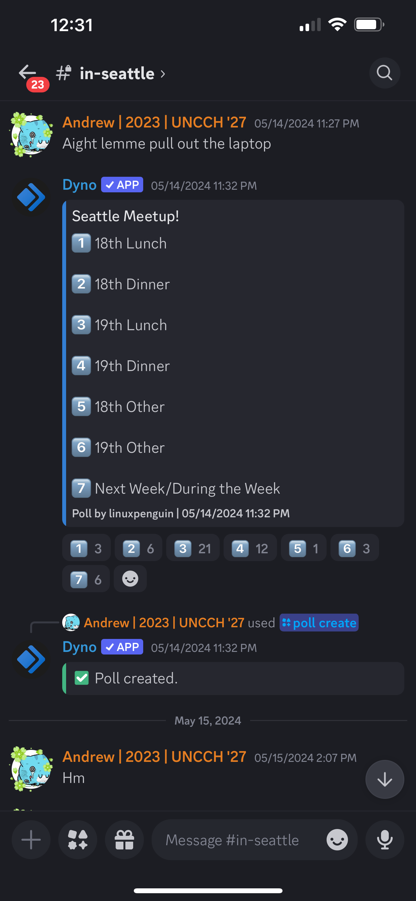
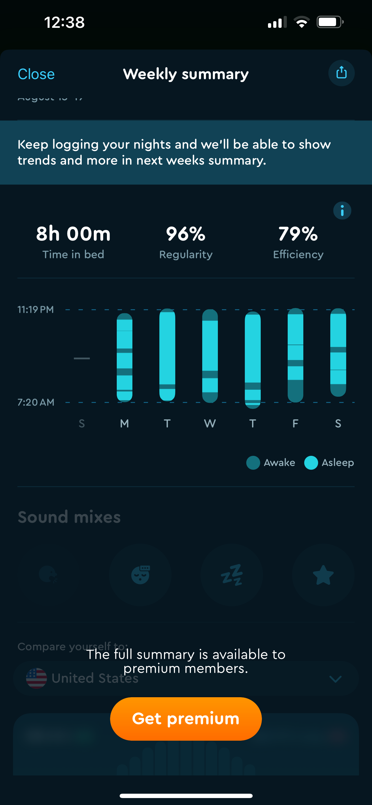
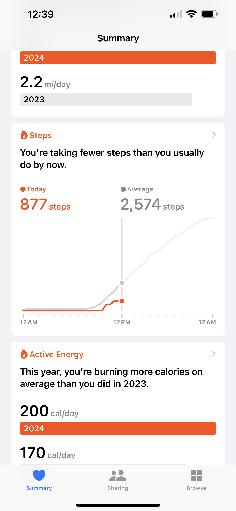
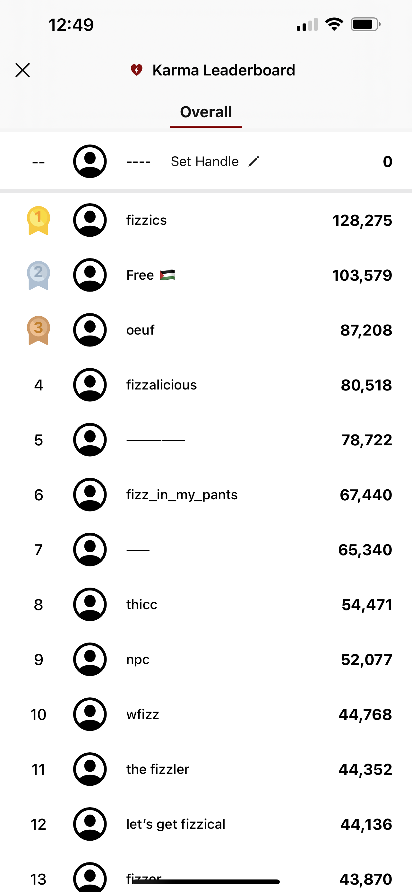
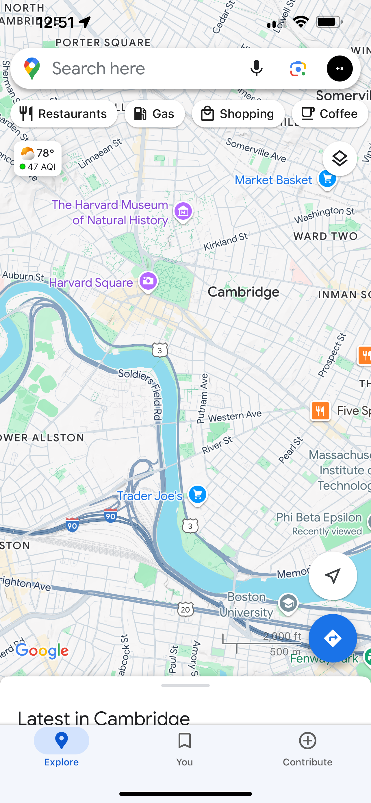
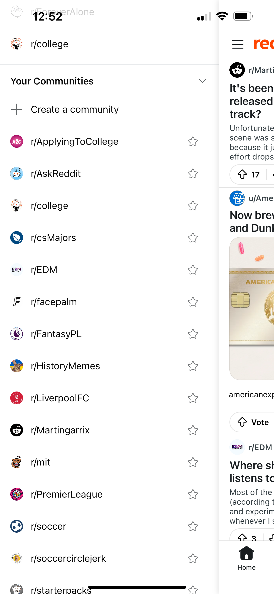
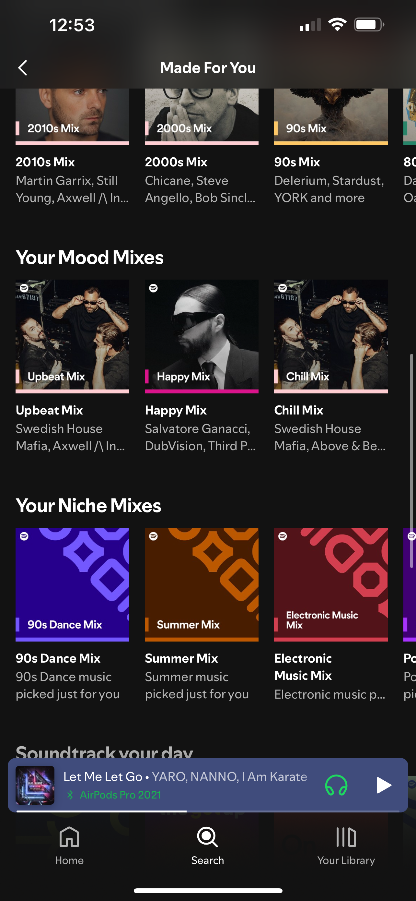
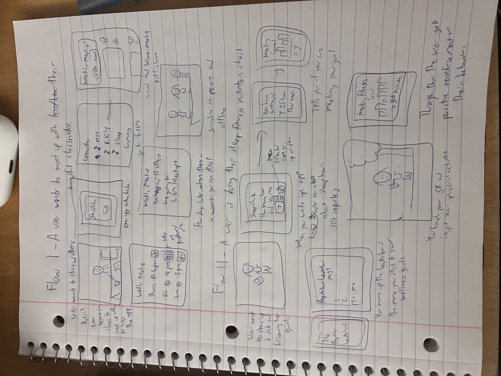

# Assignment 2

No collaborators.

# Task 1 - Audience and Value

From my interviews, I found that there is not much of a need for an app tailored for neurodivergent people, from the people themselves. From some more research on the Internet, I saw that most neurodivergent people tend toward Reddit and Discord, and all of their needs are fulfilled toward their apps.

So I am pivoting in a new direction. StudyCalm, a mindfulness-centered social media app for college students. This can provide personalized tools to students to support their wellbeing while participating in a supportive community.

(This is not part of a task but rather a longer explanation of my app.)
StudyCalm – The transition from high school to college is not easy, as you’re living on your own for the first time and have to make your own decisions on how to live your life. Mainstream social media paints a glamorous picture of friends and trips and outings, but that’s an idealized version of everyone’s life, and those less social might not enjoy these apps and not have a replacement. So this can be a community that supports each other mentally, and giving each other accountability and advice (but not generic motivational posts from the Internet, but rather tailored toward the college itself), while the app can also provide personalized mindfulness tools for the user. Something like this could make students the best versions of themselves without having to pay for therapy.

# Task 2 - Comparables

This is a Discord poll created by a user which calls a Discord bot, here used for meetup purposes. I am iterating on that for study groups and meetups for affinity groups in my wellbeing app. The twist is that to not have to think of times, the app could automatically suggest a few times.

This is from the Sleep Cycle app I occasionally used in the past. For my wellbeing social media app I can implement a stripped down version of this that just tracks length of sleep, not necessarily start and stop, and asking you if you hit your goal.

Similarly, a fitness tracker just like my built in iPhone Health app here that tells me if I did more steps than average, my app can tell you if you hit your fitness goals, or productivity goals, or anything else. You're doing more studying than average today.

Just like this leaderboard on Fizz, an MIT meme/discussion app, we'll have a leaderboard for reputation that generally rewards wholesome participation in the community, as well as the mentor programs and study groups that I detail below. Also leaderboard for who is closest to meeting their wellness goals.

This is Google Maps. To slightly differ from subreddits and affinity communities, we could make a sort of imaginary map of all the hobbies in the world, essentially a graph that shows all the communities in the app, with closer related ones closer together. And then how big your empire is depending on how many communities you're in.

This is my list of subreddits on Reddit that I'm a part of, to iterate on this, we'll have a few pinned communities such as your school and your class groups and other things I'll detail below.

Here Spotify makes me some personalized mood playlists. My twist is collaborative personalized mood playlists, perhaps even one for each community or affinity group.

# Task 3 - Features

Sleep Log - A big part of mindfulness and wellbeing is good sleep. When you sign in, you can create a private sleep target, say 6 or 7 or 8 hours, and then each time you wake up the app asks you how long you slept. If you’re not hitting your goals, the app might recommend rethinking what’s keeping you up late and remind you about balance.
User-created motivational quotes – We don’t want generic motivational posts and quotes from the Internet, as it’s kind of overdone. This is a supportive community that goes both ways, so if you want to get motivation, you have to send motivation as well. If you opt into a daily motivational quote, you must write your own motivation at least once a week, and others will see it anonymously. (Messages will be screened before sending them out.)

Pomodoro – It’s the all in one wellbeing social media app, so while this already exists as many standalone apps, we can integrate this. When you’re in Study Mode, it will remind you to take a break and drink water every 25 minutes.

Study Mode – Yes this is its own feature. It’s like the Do Not Disturb on every social media app, as it also blocks notifications to let you focus, and lets other people know that you have to focus, but what makes it different is that it also enables the Pomodoro feature to keep you productive.

Moodboard - You can choose one emoji to describe your day at the end of each day, and in the long run, you can see a whole calendar of your daily moods, as well as other’s moodboards as well if they are public or private.

Accountability Partner - App can match you with an accountability partner, another student with similar aspirations, and through DMs you can share your goals for the week and keep each other posted on your progress.

Big Little - Similar to Accountability Partner, but underclassmen can be matched with an upperclassman for advice on a pset or a future exam or nonacademic stuff as well, just anything on their mind about college life that they want to know.

Fitness Log - Similar to my own sleep log, you put your fitness goals for the week, how many days (or total minutes) you want to work out that week, and then you self evaluate at the end if you hit your fitness goals for the week.

Calorie Counter - This is optional and will be less used than the sleep and fitness logs, as it’s more for people who would like to lose weight or recovering from EDs. But this is important for their mindfulness and wellbeing as well.

Reputation - Similar to Reddit karma, you can get reputation or rank up for participating in the accountability partners or big little thing, or correctly following the Pomodoro thing, or reaching your sleep or fitness goals.

Affinity channels - Kind of like the Yik Yak app that has a lot of interest channels with posts and memes relating to the topic, or subreddits, you can see posts by other users on any topic, and you can join whichever ones you want and create new channels as well (moderated).

Pinned affinity channels - What makes this feature different from subreddits is that you have five or so pinned channels that you can’t really change, one of them is your school channel, and the others are about sleep, food, exercise, hydration, and gratitude. This keeps the most important things there.

Valentine’s matchmaking - This is a reach and I won’t get to implement this in my MVP, but we could in theory do a mindful alternative to the dating apps that most young people feel dissatisfied with for being too transient and too focused on physical appearance. Once a year we could play Cupid for the whole user base if they opt in. Datamatch vibes.

Gratitude channel - Expanding on point 12, one of the channels, you can earn reputation by posting something you’re thankful about at the end of each day. This keeps the good vibes coming.

Pomodoro distraction channel - While you’re on a five minute break from studying, you can post anything on your mind to this miscellaneous channel, and it gets rewarded doubly as you’re using your break from productivity to engage with the other users in some shape or form.

Wellness leaderboards - This is opt in, but if you want to, you can compete with other users over who gets the most sleep or who does the most exercise, but this is just for fun, we don’t want people to feel bad if they’re not at the top.
Collaborative playlist – As music is universally loved, the whole community can have access to this endless Spotify playlist that anyone on the app can add to, much like the recitation playlist that is not gaining much steam 🙁This will capture the aggregate vibe of the app.

Daily verse - If you identify as religious when signing up, the app can provide a daily thoughtful random verse from your religious text of choice.

Study groups - People with the same classes in their profile will be put into common groups and if someone inputs assignment due dates or exam dates into the system, the app could generate an afternoon/evening/weekend time for everyone to study or work together in person. Or people could thumbs up different suggested times. But the app will promote that camaraderie in person as well. Location the people will have to decide for themselves.

Journal - This is private, and while this feature already exists as many standalone apps, to make this unique, the journal could also show you an entry from six months ago or 1 year ago or more (to the day), to remind yourself how far you’ve come.

Three Goals - At the center of every user profile they have three long-term goals for the next year or so. This is public to hold everyone accountable and support each other! The best goals could be thumbs-upped the most and also put into a leaderboard.

# Task 4 - VSD Analysis

Sustained Friendships - The app is meant to create mindful friendships where the people on the app are keen on their wellbeing. A common criticism with today’s social media is that it values virtual interactions over in person interactions, which can lead to loneliness if the person prefers in person. So my feature 19, where the app can schedule a study group for people in the same class, I could expand on this to automatically schedule at least a monthly or biweekly in person meetup for each channel/affinity group. By cultivating shared hobbies in person you can develop sustained friendships.

Widespread Use - Some of my features are tailored toward a smaller user base, and might not scale properly. But I can think of some ways to make it more scalable. For example, if thousands of people contribute to a collaborative playlist, it will be all over the place, so also introduce smaller playlists representing genres or moods from the moodboard (another of my features). But with schools and classes I think the meetup functionality won’t have to significantly change.

Variation in Human Ability. - Accessibility is very important, especially when considering an app around wellness. If we don’t accommodate for the differently abled, people seeking support won’t use our app. We can do the usual accessibility features that other apps do like changing font size and text to speech, but my twist on it would also be built in affinity groups for each condition, and iterating on my big/little feature to match you with someone older who also has the condition to provide support and advice.

Indirect Stakeholders - I’m thinking that the indirect stakeholders would be user’s friends and family who do not use the app. Friends who are not on it might either feel left out or think they’re a cheesy nerd for joining the app. To make the app more inclusive, we could make all the wellness log, matching, etc. features for full users (still free), but for people who just want to see the memes in the channels and react to them, they are welcome to do so as well as limited users.

Work of the Future – My app also ties into productivity with its Pomodoro feature. If this app gains a significant user base, and the technique works for them, it could make the population more productive as a whole. However, this does not work for everyone. Some people prefer to work in longer chunks, and we have to accommodate them as well. We can expand on the Pomodoro timer by letting you choose your own custom productivity timers to fit your style of work, with feedback after the week either on continuing or modifying your approach.

# Task 5 - Storyboarding

First one is a storyboard that follows meeting up with others and engaging on the app, including the meetup poll, and the second one shows them inputting their sleep and fitness logs for the day and getting satisfaction from it. Handwriting is somewhat rushed but I drew some graphs and menus.

