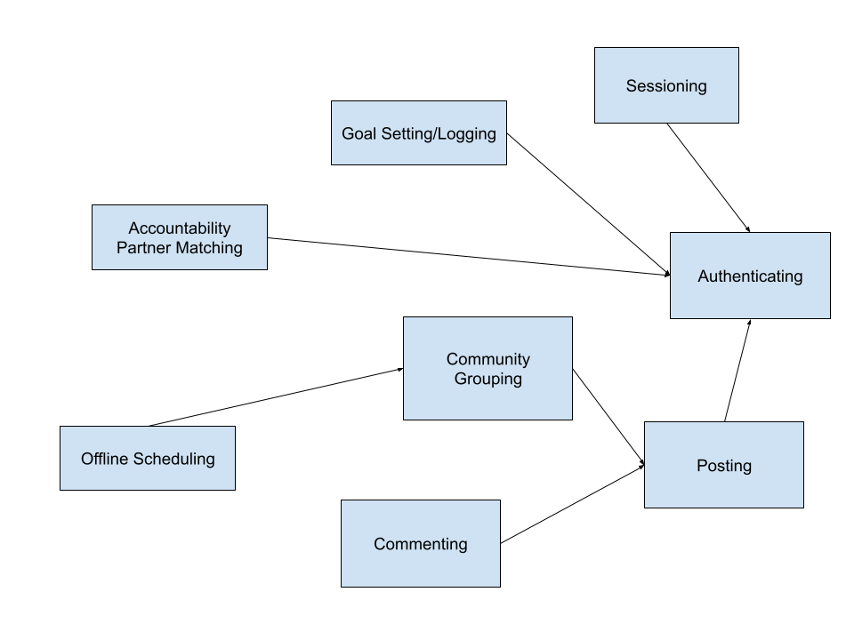

# Assignment 3 - Convergent Design

Collaborator - ChatGPT (proofreading only)

# Pitch

The transition from high school to college can be overwhelming. Students learn to live on their own for the first time and have to make their own decisions in their academic, social, and professional lives. Mainstream social media paints a glamorous picture of friends and trips and outings, and many students feel isolated by the lack of genuine connection and support. StudyCalm is a mental health-focused community that provides users with accountability, guidance and positivity. Users can connect with others in their school and in their specific classes, sharing advice and encouragement. There is a social aspect, including affinity groups that encourage offline meetups, and a personal aspect that includes goal setting tools for productivity and wellbeing. This can be a supportive space for students who might not have access to traditional therapy for financial or other reasons.

By blending mindfulness with peer connection, StudyCalm helps students become their best selves -- emotionally resilient, focused, and connected -- throughout their college journey.

# Concept 1 - Authenticating

Purpose: Authenticate users so that app users correspond to people

Operational Principle: A user can authenticate with a chosen username and password pair after registering with those fields

State:

- registered: set User - {userId, username, email, passwordHash}
- username, password: registered -> one String

Actions:

- register (name, pass: String, out user: User)
- authenticate (name, pass: String, out user: User)

# Concept 2 - Sessioning [User]

Purpose: Enable authenticated actions for a given period of time

Operational Principle: After a session starts (and before it
ends), the getUser action returns the user identified at the start

State:

- active: set Session
- user: active -> one User

Actions:

- start (user: User, out session: Session)
- getUser(session: Session, out user : User)
- end(session: Session)

# Concept 3 - Posting [Content, Environment]

Purpose: Users can post items for other users in an environment

Operational Principle: After making a post in an environment, that post is available to other users, which can also be later deleted by the user or liked by other users.

State:

- posts: set Post
- content: posts -> one Content

Actions:

- post(user: User, content: Content, env: Environment, out postID: Integer)
- delete(user: User, postID: Integer, out content: Content)
- like(user: User, postID: Integer out likes: Integer)

# Concept 4 - Commenting [Content]

Purpose: Users can comment in reply to other items

Operational Principle: After making a comment on an item,
when a user brings up that item, the comment is also included

State:

- comments: set Comment
- content: comments -> one Content

Actions:

- publish(user: User, content: Content, itemID: Integer, out commentID: Integer)
- delete(user: User, itemID: Integer, commentID: Integer, out content: Content)
- like(user: User, itemID: Integer, commentID: Integer, out likes: Integer)

# Concept 5 - Goal Setting and Logging [Goals, GoalType, Trend]

Purpose: Users can track their long and short term goals for their and/or others' viewing

Operational Principle: After setting sleep and fitness goals, and other custom goals, a user is prompted to log their progress and mood daily and reflect and view trends.

State:

- allGoals: set Goal
- goalType: allGoals -> one GoalType
- goalProgress: allGoals -> one Trend

Actions:

- setGoals(user: User, goal: Goal, type: GoalType)
- logGoals(user: User, progress: String, type: GoalType)
- checkProgress(user: User, type: GoalType, out trend: Trend)
- shareGoals(user: User)

# Concept 6 - Offline Scheduling [Event, Time, Community, User]

Purpose: Promote offline meetups and activities for mental health and wellbeing, based around in-app communities/channels

Operational Principle: A channel/community flexibly schedules an in-person weekly/biweekly/monthly meetup for users in a community to connect offline in a public place, and a user in this community has the choice to vote on the best time and RSVP accordingly.

State:

- Events: set Event
- Frequency: Event -> one Time
- Association: Event -> one Community
- Attendees: Event -> one set User

Actions:

- createEvent(comm: Community, time: Time, location: String, out eventID: Integer)
- notifyUsers(comm: Community, users: set User)
- joinEvent(user: User, eventID: Integer, out attendeeCount: Integer )
- voteOnTime(user: User, eventID: Integer, time: Time)
- voteOnLocation(user: User, eventID: Integer, location: String)
- leaveEvent(user: User, eventID: Integer, out attendeeCount: Integer)

# Concept 7 - Accountability Partner Matching [ User, Goals, Trend, Content]

Purpose: Foster a supportive community through peer connections and accountability to better achieve users' goals

Operational Principle: A user wants to be held accountable to follow their goals and is matched with another like-minded user according to similarity in goals for a period of time. They are free to message and keep up on each other's progress.

State:

- Unmatched Pool: set User
- Partnerships: set User-User
- Goals: User-User -> one set Goal, one set Goal
- Progress: User-User -> one Trend, one Trend

Actions:

- requestPartner(user: User)
- acceptPartner(user: User, other: User)
- shareGoals(user: User, other: User, goals: set Goal)
- message(user: User, other: User, message: Content)

# Concept 8 - Community Grouping [Community, User, Content]

Purpose: Create community in the app through affinity groups where relevant content can be created by and displayed to users

Operational Principle: A user wants to see content related to an interest of theirs. They can join a community relevant to that interest, or create a new community around the interest. Once joined, the user can see, create content, and react to existing content.

State:

- Communities: set Community
- Members: Community -> one set User
- Content: Community -> one set Content

Actions:

- createCommunity(user: User, name: String, out comm: Community)
- joinCommunity(user: User, comm: Community)
- leaveCommunity(user: User, comm: Community)
- addContent(user: User, comm: Community, contentID: String)

# App Level Actions [Community, User, Content]:

sync register (username, password: String, out user: User)

- Authenticating.register(username, password, user)

sync login (username, password: String, out user: User)

- Authenticating.authentiate(username, password, user)
- Sessioning.start(user, session)

sync logout (session: Session)

- Sessioning.end(session)

sync post(user: User, post: Content, comm: Community)

- Community Grouping.joinCommunity(user, comm) (only if not yet joined)
- Posting.post(user, post, comm), out postID
- Community Grouping.addContent(user, comm, postID)

sync likePost(user: User, postID: Integer)

- Posting.like(user, postID)

sync commentOnPost(user: User, comment: Content, postID: Integer)

- Commenting.publish(user, content, postID)

sync commentReplyToComment(user: User, comment: Content, commentID: Integer)

- Commenting.publish(user, content, commentID)

sync likeComment(user: User, commentID: Integer)

- Commenting.like(user, commentID)

sync deletePost(user: User, postID: Integer)

- Posting.delete(user, postID)

sync deleteComment(user: User, commentID: Integer)

- Commenting.delete(user, commentID)

sync createEventInExistingCommunity(user: User, comm: Community, time: Time, location: String)

- Community Grouping.joinCommunity(user, comm) (if not yet joined)
- Offline Scheduling.createEvent(comm, time, location)
- Offline Scheduling.notifyUsers(comm, comm.Members)

sync createEventInNewCommunity(user: User, communityName: String, time: Time, location: String)

- Community Grouping.createCommunity(user, communityName) out comm: Community
- Offline Scheduling.createEvent(comm, time, location)
- Offline Scheduling.notifyUsers(comm, comm.Members)

sync joinExistingEvent(user: User, comm: Community, eventID: Integer, time: Time, location: String)

- Community Grouping.joinCommunity(user, comm) (if not yet joined)
- Offline Scheduling.joinEvent(user, eventID)
- Offline Scheduling.voteOnTime(user, eventID, time)
- Offline Scheduling.voteOnLocation(user, eventID, location)

sync leaveEvent(user: User, eventID: Integer)

- Offline Scheduling.leaveEvent(user, eventID)

sync findPartner(user: User, goals: set Goal)

- Accountability Partner Matching.requestPartner(user)
  (wait to be matched... pull from Unmatched Pool) out other : User
- Accountability Partner Matching.acceptPartner(user, other)

sync setSleepGoal(user: User, goal: Goal)

- Goal Setting.setGoals(user, goal, GoalType.Sleep)

sync setFitnessGoal(user: User, goal: Goal)

- Goal Setting.setGoals(user, goal, GoalType.Fitness)

sync setOtherGoal(user: User, goal: Goal)

- Goal Setting.setGoals(User, goal, GoalType.Misc)

sync shareGoals(user: User, other: User, goals: set Goal, type: GoalType)

- Goal Setting.setGoals(user, goal, type) for each goal: Goal in set Goal
- Accountability Partner Matching.shareGoals(user, other, goals)

sync messagePartner(user: User, other: User, message: Content)

- Accountability Partner Matching.message(user, other, content)

# Dependency Diagram

