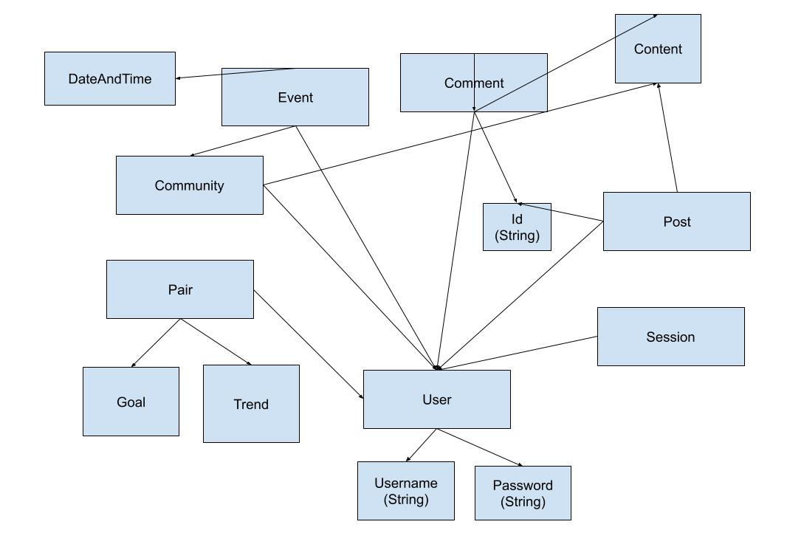

# Assignment 4 Alpha

No collaborators.

## Link to Backend Repository

https://github.com/mquispe27/study-calm-backend

## Link to Commenting Concept

https://github.com/mquispe27/study-calm-backend/blob/main/server/concepts/commenting.ts

## Link to Grouping Concept

https://github.com/mquispe27/study-calm-backend/blob/main/server/concepts/grouping.ts

## Link to Other Concept Route Skeletons

https://github.com/mquispe27/study-calm-backend/blob/main/server/routes.ts

## Deployed Service on Vercel

https://study-calm-backend.vercel.app/

## Abstract Data Models -- reused but tweaked from A3

### Concept 1 - Authenticating

registered --> one User
username : registered --> one String
password : registered --> one String

### Concept 2 - Sessioning [User, Session]

session --> set Session
user : session --> one User

### Concept 3 - Posting [Post, User, Content]

posts --> set Post
post : posts --> one Post
id : post --> one String
author : post --> one User
content : post --> one Content

### Concept 4 - Commenting [Comment, User, Parent]

comments: --> set Comment
comment : comments --> one Comment
id : comment --> one String
author : comment --> one User
content: comment -> one String
parent: comment --> one Parent

### Concept 5 - Grouping [User, Community, Content]

communities --> set Community
founder: Community --> one User
members: Community -> one set User
content: Community -> one set Content

### Concept 6 - Scheduling [Event, DateAndTime, Community, User]

events: set Event
time: Event --> one DateAndTime
frequency: Event -> one DateAndTime
association: Event -> one Community
attendees: Event -> one set User

### Concept 7 - Matching [Users, Goals, Trend, Content]

unmatched: set User
matched: set (User, User)
goals: (User,User) -> one set Goal, one set Goal
progress: (User, User) -> one Trend, one Trend
