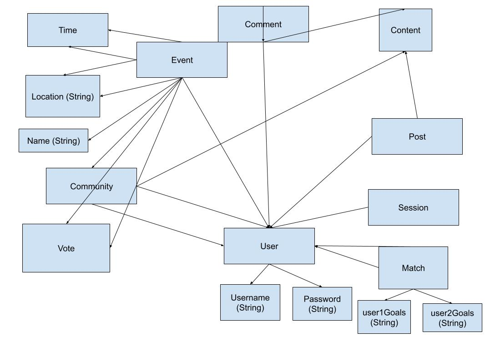

# Assignment 4 Beta

No collaborators.

## Link to Backend Repository

https://github.com/mquispe27/study-calm-backend

## Link to Commenting Concept

https://github.com/mquispe27/study-calm-backend/blob/main/server/concepts/commenting.ts

## Link to Grouping Concept

https://github.com/mquispe27/study-calm-backend/blob/main/server/concepts/grouping.ts

## Link to Matching Concept

https://github.com/mquispe27/study-calm-backend/blob/main/server/concepts/matching.ts

## Link to Scheduling Concept

https://github.com/mquispe27/study-calm-backend/blob/main/server/concepts/scheduling.ts

## Link to All Routes

https://github.com/mquispe27/study-calm-backend/blob/main/server/routes.ts

## Deployed Service on Vercel

https://study-calm-backend.vercel.app/

## Abstract Data Models -- reused but tweaked from A3

### Concept 1 - Authenticating

registered --> one User

username : registered --> one String

password : registered --> one String

### Concept 2 - Sessioning [User, Session]

session --> set Session

user : session --> one User

### Concept 3 - Posting [Post, User, Content]

posts --> set Post

post : posts --> one Post

id : post --> one String

author : post --> one User

content : post --> one Content

### Concept 4 - Commenting [Comment, User, Parent]

comments: --> set Comment

comment : comments --> one Comment

id : comment --> one String

author : comment --> one User

content: comment -> one String

parent: comment --> one Parent

### Concept 5 - Grouping [User, Community, Content]

communities --> set Community

founder: Community --> one User

members: Community -> one set User

content: Community -> one set Content

### Concept 6 - Scheduling [Event, Time, Vote, Community, User]

events: set Event

time: Event --> one Time

location: Event --> one String

association: Event -> one Community

possibleTimes: Event --> one set Time

possibleLocations: Event --> one set possibleLocations

name: Event --> one String

votesOnTimes: Event --> one set Vote

votesOnLocations: Event --> one set Vote

attendees: Event -> one set User

### Concept 7 - Matching [Users, Goal, Match]

matches: set Match

user1: Match --> one User

user2: Match --> one User

matchStatus: User --> one String

user1Goals: Match --> one String

user2Goals: Match --> one String

## Reflection 

There were many things that I only somewhat had an idea going into this assignment that were very solidified once I implemented the backend itself. For example, since it was enough work to just implement seven concepts, I had to make some tradeoffs about what to leave in and what to leave out. I had an ambitious idea of messaging your matches, but that is too ambitious and I won't get around to it. Instead, I combined my goal logging concept into a tiny part of the matching concept, allowing you to share your goals and see each other's goals in the accountability partner relationship, something you can't do with app friends. You're responsible for contacting each other otherwise. Also, a big 50-50 thing was whether the partner matching should be randomly assigned, or driven by user choice, i.e. they can go into the unmatched pool and choose their partner. Ideally, in a more substantive app, there would be some ML algorithm that pairs the most similar people together. In the end, I realized that the given friending concept gives the user control, and matching should have the opposite effect -- create an unexpected connection through random assignment, the randomness here being the order of signing up into the pool. This random arrangement of matches lets the concept stand on its own. I also got feedback to have a separate Voting concept, and while that sounds good, time constraints mean that I integrated it with the Scheduling concept itself. It shouldn't completely separate -- after all, you can only vote on the events, so I was able to come up with some nuanced logic and a lot of edge cases to handle proper event time and location voting. All in all, I am satisfied with my hard work these last two weeks.