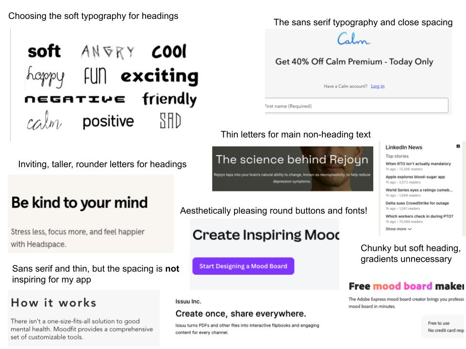

# Assignment 5 Alpha

No collaborators aside from a little bit of ChatGPT in debugging some reactive flows, like getting the community to be preserved when reloading.

## Link to Completed Frontend

Implemented all concepts for the alpha.

https://github.com/mquispe27/study-calm-frontend

## Link to Deployment

https://study-calm-frontend.vercel.app/

## Heuristic Evaluation

I will look at seven different design factors for my heuristic analysis.

### Usability Criteria - Discoverability

- My interface at first glance is somewhat a combination of Fizz and Yikyak/Sidechat, two popular apps among college students, though integrating novel concepts not seen in these applications. This definitely makes things more discoverable to students.

- These features include pins clearly showing what communities you can or can't leave, though the way I structured my backend for the beta assignment, I would have to add support for pinned communities that cannot be deleted, left, or joined. I'd have to do some more implementation in order to enhance this intuitive discoverability.

### Usability Criteria - Accessbility

- While my app is definitely mindful in nature, with the focus around goals and holding yourself accountable in a community, and many offline events as seen in my wireframes, there is a considerable lack of accessbility features in my wireframes. The least I should do in my app is add a light mode / dark mode and also make sure that zooming in or out works correctly and maintains the proportions of the app without introducing any bugs.

### Usability Criteria - Security

- There is no current way in my app to see any information about a user other than their username. When I'm matched with an accountability partner, I can also see their goals, but everything else about the user is encapsulated, not that there is anything sensitive to begin with.

- Only thing that might be a concern is locations, as the events board, which is a big part of the app, has a time and location for each activity, but what I can do for privacy reasons is to make the attendee list not public, so that only the organizer will be able to see it, otherwise you can only see the number going and the number of votes for times and locations, and even those numbers you can only see if you part of the community.

### Physical Criteria - Perceptual Fusion

- There are no loading screens in my wireframes, only because I didn't think there will be any intensive operations in my app. But even on the small scale apps like Fizz, I know that retrieving a feed could take a non-instant timeframe, so I will definitely look into adding a loading screen that is pleasing to look at, even if just for a split second.

### Physical Criteria - Accelerators

- As communities scale, it can be harder to scroll to the right community/group, so it is in my best interest to include a simple search bar that filters the groups, which I did not account for in my wireframes. This will also help in the "find new communities" button that lists new communities to join, which will have a lot of new ones in an app with more users, and also for filtering events in each community's events board.

### Linguistic Level - Information Scent

- In the page where you can browse and join communities, there will be useful information, such as the creator, the description, and the number of members in the group, all laid out in tiles, much like how I analyzed Hydrant in my blog for the UI lecture. Same for the events board, which is also a good place to be bombarded by information.

### Linguistic Level - Consistency

- As said in the discovery observation, the interface is roughly consistent with its peers YikYak/Sidechat and Fizz, two apps that I am familiar with.
- As for consistency within button patterns and things, I have to consider how greyed out text can either be considered unavailable or out of focus.
  - In my case, I have to highlight the currently selected community, which I did in the wireframe as literally highlighting it with another shade, but in my wireframe in another place, to confirm I'm going to an event, I had "I'm going" as colored changing to Going with a plain text background.
  - This colored to white transition is the opposite of light to colored for community selection, so I have to go all in on one of those alternatives as I implement.

## Addressing A4 feedback

This is not a necessary part of the assignment but I still wanted to include it to show I'm trying to take things into account. First of all, you will notice that I fixed deleting events, as the fact that only the creator can delete the event is absolutely necessary, and while I did it for communities, I forgot to do the same for events.

And for getMatchOrStatus (GET /api/matches), I definitely iterated on that endpoint, as the information I needed for it, I definitely fine tuned it to account for being matched, unmatched, and in or out of the matching pool. Should be fine now. I changed all add/remove endpoints to something flatter where I can just patch to add or remove depending on a body parameter, so that should be better too. Lastly, I also realized that it would be weird to remove possible times or locations that others have suggested, and it gets too complicated and granular to keep track not only of the user's votes but also which times and locations they suggested, I just executively decided to let any attendee suggest times and locations, but only the creator can delete times and locations.

## Visual Design Study

### Colors

### Fonts

