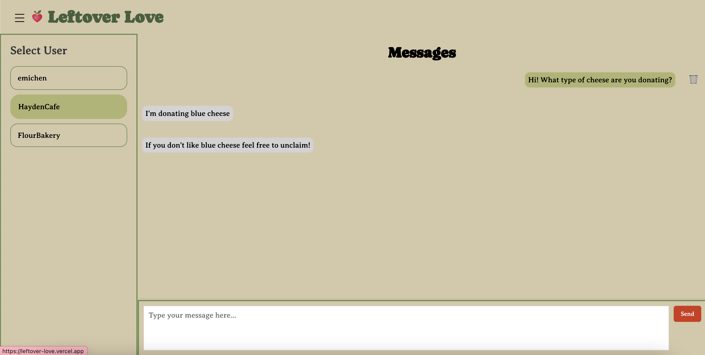
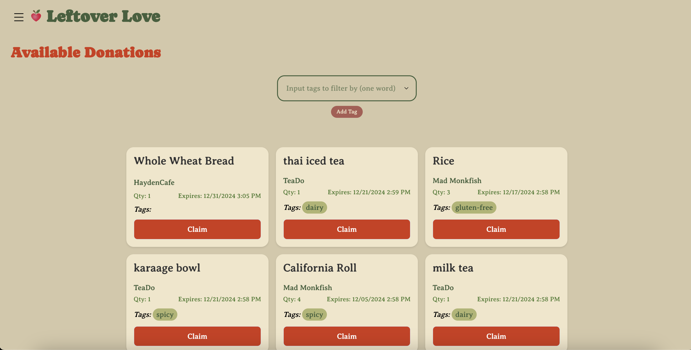
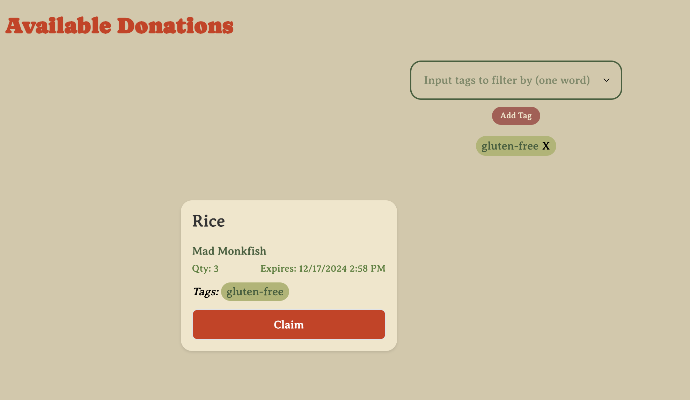
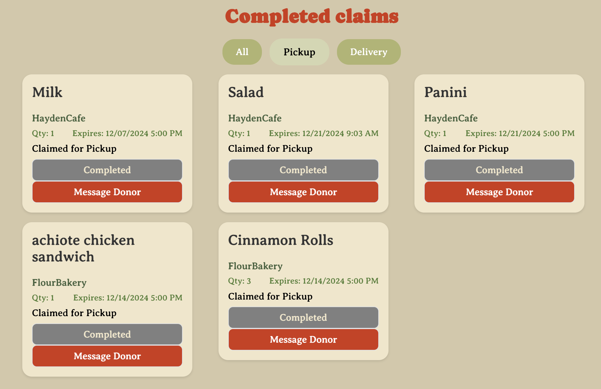
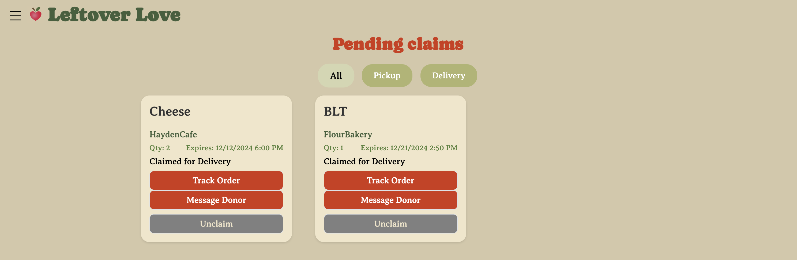
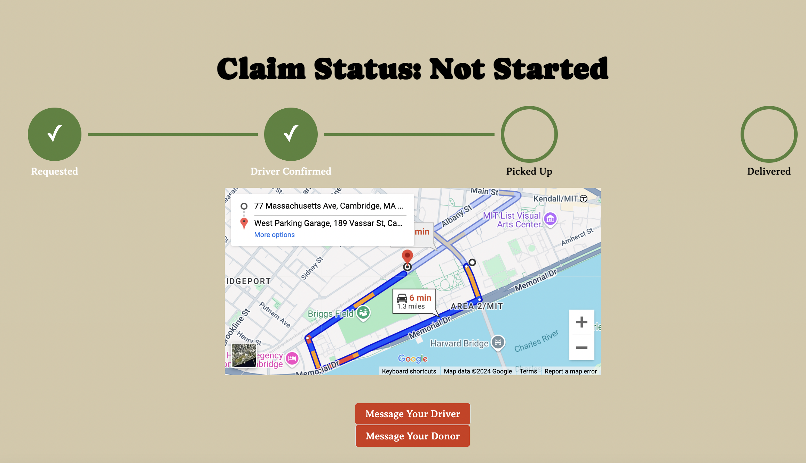
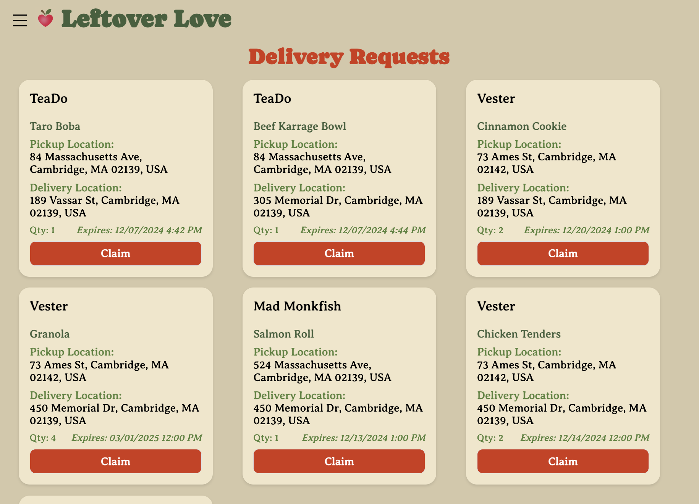
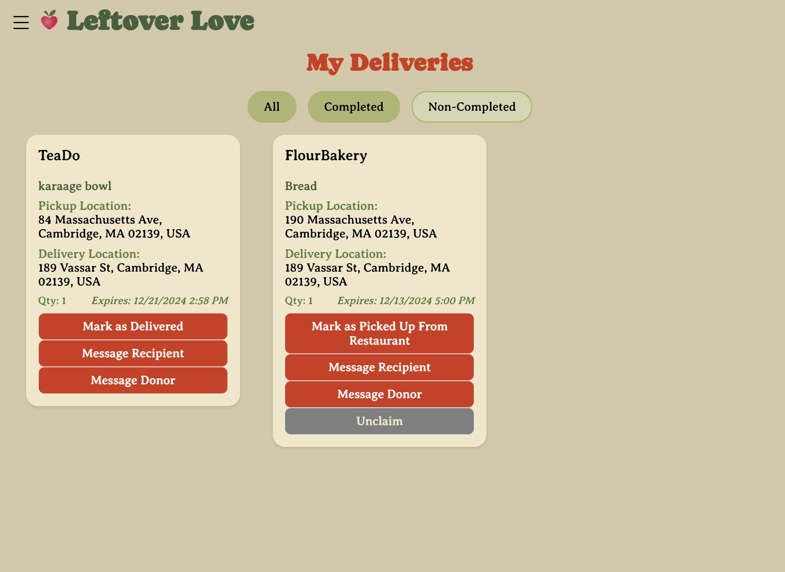

# Project 5: Beta Release

## Code Implementation

Github Repo:
https://github.com/emilymchen/leftover-love

## Deployed Site

Deployed Site: https://leftover-love.vercel.app/welcome

## Design Revisions

### Change I: Limits on Quantity of Food in Food Posting

**Updated Design:**
Previously, the `quantity` parameter in Posting was unrestricted. While we retained `quantity` as a state parameter, we implemented a cap of 5 for its maximum value, preventing users from inputting a number greater than 5 for `quantity.`During the design process, we faced two primary options: (1) cap the `quantity` value or (2) allow users to specify any number, with the option for recipients to claim subsets of the total quantity (e.g., multiple people claiming portions of a single post).

**Reasoning:**
We chose the first option for two key reasons:

- Implementation simplicity: Capping the value to 5 was more feasible within our project timeline, avoiding the complexity of managing multiple claims per post.

- Focus on small-scale restaurants/donors: We decided to shift our focus/target audience to smaller restaurants, which, as revealed through interviews, face fewer legal challenges than larger corporations and typically deal with smaller portions. Because they face fewer legal challenges, they are also more likely to engage with the application compared to larger established corporations.

While this limitation narrows the potential scale of individual donations, it strengthens the case for our app’s focus on serving small businesses and promoting sustainability at a community level.

### Change II: Adding Instructions as a State for Claiming

**Updated Design:**
In our initial design, we did not include `instructions` as a state for claiming. However, we have now added this feature, allowing recipients to provide specific instructions (e.g., "leave it at the door") when requesting a delivery.

**Reasoning:**
During development, we recognized that including an `instructions` parameter would enhance user experience by offering recipients greater flexibility and clarity in specifying delivery preferences. This feature aligns with the functionality of similar applications, such as DoorDash, which improves familiarity and usability for users.

### Change III: Removal of `delivery_time` as a State for Delivering

**Updated Design:**
In our initial design, `delivery_time` was included as a state for Delivering. However, we removed it during implementation due to practical and usability considerations. The app now relies solely on the inherent `expiration_time` associated with each food donation.

**Reasoning:**
We identified several issues with including `delivery_time`:

- Redundant information: Each donation already has an expiration time, making a separate `delivery_time` parameter unnecessary and adding unnecessary complexity to the interface. We also have a messaging feature, which makes it easier for the volunteer and recipient to communicate and agree on an established delivery time.

- Deciding who determines the delivery_time poses significant challenges. Assigning this responsibility to restaurants is impractical since their involvement ends after food pickup. Similarly, requiring recipients to set delivery times could lead to unrealistic expectations and scheduling conflicts for volunteers.

- Volunteer experience: Allowing recipients to specify arbitrary or inconvenient delivery times could deter volunteers from participating, undermining their critical role in the app's success.

This modification simplifies the app’s design, reduces cognitive load for users, and ensures the process remains practical for all those who use the app.

### Change IV: Adding Preset Tags to Select On Top of Self Defined Tags for Filtering

**Updated Design:**
In our initial design, we did not include a series of the most common preset tags for recipient users to select from to filter their available donations. We have now added this preset tags feature as an add on to the previously established self defined tags.

**Reasoning:**
In the feedback we received from the previous assignment, we realized that adding another easy and efficient way for recipient users to add tags for filtering would greatly improve the user experience. This offers users greater sense of flexibility and increases efficiency, allowing users to directly select from a list of commonly appearing tags.

### Change V: Removing Image Upload for Food Postings

**Updated Design:**
In our initial design, we had food donors upload an image while posting food, which would then be displayed in the feed along with other details about a food listing. We have removed image uploading, so instead, the food name and details are the only things displayed in the feed.

**Reasoning:**
We wanted to reduce the amount of friction for donors to list food as much as possible, and for restaurants who may be listing tens of plates of food, having to take pictures for each of these items would be tedious and time-consuming. Additionally, it allows us to display more useful information such as the food’s tags and expiration time in a more compact manner.

## Prepopulated Realistic Data

## 1. Prepopulate Data

Link To Website: https://leftover-love.vercel.app/welcome

To prepopulate the website, we created a number of real potential users. For each of the users, we enabled a number of different features, ranging from creating conversations between a couple of users, creating food donations, claiming food donations, and creating delivery requests.

You can log into the following accounts:
Restaurant Role

```
username: FlourBakery


password: password
```

Volunteer Role

```
username: emichen


password: password
```

Recipient Role

```
username: sabrinado


password: password
```

to see one of the example profiles!

We also have a couple of other false accounts besides these listed sample accounts (e.g. HaydenCafe, TeaDo, Mad Monkfish). I have populated the app with real messages to the accounts, food donations posts, food request claims, and food deliveries.

**Sample Conversation:**


**Food Donation Posts:**


(Filtered Posts)


**Food Claims:**

(Completed Claims)


(Pending Claims)


**Food Deliveries:**

(Order Tracker)


(Delivery Requests)


(My Deliveries )


## Task List

<table>
 <thead>
   <tr>
       <th>Role</th>
       <th>Task Title</th>
       <th>Instruction</th>
       <th>Rationale</th>
   </tr>
 </thead>
 <tbody>
   <tr>
       <td>Restaurants/Donors</td>
       <td>Account Creation</td>
       <td>
           <ol>
           <li>Create an account with your business.</li>
           <li>Log out of your account.</li>
           <li>Log back into your account.</li>
           </ol>
       </td>
       <td>
           Tests the account creation process and address input functionality and its intuitiveness for restaurants/donors.
           <br><br>Registering is necessary as all users need to be registered. Registration is where individuals designate their roles.
           <br><br>It is also important for users to easily locate and access logging in and logging out features.
       </td>
   </tr>
   <tr>
       <td>Restaurants</td>
       <td>Account Update</td>
       <td>
           <ol>
           <li>Change your business address.</li>
           <li>Change your username.</li>
           <li>Change your password.</li>
           </ol>
       </td>
       <td>
           Tests that account information can be successfully and efficiently modified, ensuring account updating is intuitive and accessible.
           <br>
           <br>Only restaurants can input their address, reflecting their specific needs.
       </td>
       </tr>
   <tr>
       <td>Restaurants/Donors</td>
       <td>Food Donation Listing, Editing, and Deletion</td>
       <td>
       <ol>
           <li>List a donated food item with two tags and quantity = 1.</li>
           <li>Edit one item to add tags and change the quantity.</li>
           <li>Edit another item to remove one tag and change expiration date.</li>
           <li>Delete one of your listed posts.</li>
       </ol>
           <br><br>Follow-Up: Was it easy to create and interact with a food donation post? Did you encounter any limitations while trying to make a post?
       </td>
     <td>
           Evaluates the item listing process and tag system, addressing the core functionality for donors – making items available for claiming and delivery – and makes sure this process is painless, intuitive, and seamless finding areas for improvement.
           <br><br> Next, we have an exhaustive combination of all editing inputs, which protects against unexpected behavior and addresses the use case of the donor needing to amend information.
           <br><br>Protects against unexpected behavior and addresses the need for amending information.
           <br><br>Tests the item removal functionality and is necessary for the use case of donors needing to completely get rid of an incorrect post.
           <br><br> Also aims to get insights into the unique needs/preferences of users when trying to make a food donation post (e.g. if we need to add more features/parameters).
     </td>
   </tr>
   <tr>
       <td>Restaurants/Donors</td>
       <td>Message Response</td>
       <td>1. Reply to messages from a recipient.</td>
       <td>
           The donor is the only role that does not have a message other-role button in the dashboard, so we hope to see that they will naturally find it in the sidebar, as this is crucial for interacting with recipient and volunteers’ questions, notes, and concerns.
           <br><br>Also, ensures that messaging generally supports seamless and comfortable interactions between restaurants and recipients/volunteers.
       </td>
   </tr>
   <tr>
       <td>Recipients</td>
       <td>Account Creation and Editing</td>
       <td>
           <ol>
           <li>Create a recipient account.</li>
           <li>Log out of your account.</li>
           <li>Log back into your account.</li>
           <li>Change your username.</li>
           <li>Change your password.</li>
           </ol>
       </td>
       <td>
           Tests the account creation and editing process and its intuitiveness for recipients, the primary beneficiary of this app.
           <br><br>Determines if it is intuitive for recipients to correctly select the right registration pages – testing the readability/understandability of our welcome page and the intuitiveness of role selection.
       </td>
   </tr>
   <tr>
       <td>Recipients</td>
       <td>Item Claiming, Unclaiming, Completion (Pickup)</td>
       <td>
           <ol>
           <li>Claim an item for pickup.</li>
           <li>Message the donor with any questions.</li>
           <li>Unclaim the item you just claimed.</li>
           <li>Claim a different item for pickup.</li>
           <li>Mark your new claimed item as picked up.</li>
           </ol>
           <br><br>Follow-up: Was the claiming/unclaiming process straightforward? Was it clear how to message the donor?
       </td>
       <td>
           Tests the claiming and unclaiming food donation postings process.
           <br><br>Determines if the process of messaging donors is intuitive to users that have not seen the interface before or have questions about their food.
           <br><br>Assess whether it is logical and intuitive for the recipients to navigate the complete flow from claiming a food item for pickup to ultimately marking the item is picked up after completing their pickup process
       </td>
   </tr>
   <tr>
       <td>Recipients</td>
       <td>Tag Filtering</td>
       <td>
           Filter available donations by tags matching your dietary restrictions/preferences.
           <br><br>Follow-up: Did you utilize the dropdown/predefined tags feature or the manual tag input feature more for filtering? Was the filtering by tags process intuitive and useful to narrow down your search or what could make it more useful for you?
       </td>
       <td>
           Assesses the effectiveness of the tag system, whether the add/remove tag interface is easy to use and understand, and how they can use it to find exactly the food that they want to obtain.
           <br><br>This feature allows recipient users to better visualize the food options that fulfill their dietary needs, leading to a more comfortable and efficient user experience.
       </td>
   </tr>
   <tr>
     <td>Recipients</td>
     <td>Delivery Claim + Claim Management</td>
     <td>
       <ol>
         <li>Claim an item for delivery.</li>
         <li>Check your claims and toggle between All, Pickup, and Delivery views.</li>
       </ol>
     </td>
     <td>
       Makes sure the delivery claim form is approachable, from inputting your address, instructions, and seeing estimated arrival time in the map.
       <br><br>Evaluates whether the toggle helps the user better manage and visualize their orders if the recipient is dealing with many claims.
     </td>
   </tr>
   <tr>
     <td>Recipients</td>
     <td>Delivery Tracking</td>
     <td>
        As the volunteer claims your order and marks as picked up and then subsequently delivered, keep tracking your order status!
     </td>
     <td>
       As delivery can be a long process, it is important for recipients to be able to keep up with the progress of their order, and this tests not only that functionality but also the two-way communication between the driver/volunteer’s actions and the recipient’s interface.
       <br><br>Determines if users’ information needs are satisfied with the order tracking page – primarily whether they had enough information to feel reassured about their delivery or needed other information.
     </td>
   </tr>
   <tr>
     <td>Recipients</td>
     <td>Recipient Communication</td>
     <td>
       <ol>
         <li>Message your donor for additional info.</li>
         <li>Once delivered, message your driver to thank them.</li>
       </ol>
     </td>
     <td>
       Tests the effectiveness of the two flows– messaging your individual donor and driver for recipients, and secondly, switching between the two views.
       <br><br>Evaluates whether the messaging system is responsive and intuitive.
     </td>
   </tr>
   <tr>
     <td>Volunteers</td>
     <td>Account Creation</td>
     <td>
       Create a volunteer account.
       <br><br>Follow-Up: Were there any challenges in creating an account?
     </td>
     <td>
       Tests the account creation process and its intuitiveness for drivers / volunteers, which are valuable in getting the food from donor to recipient.
       <br><br>Having the account creation process for volunteers be easy and understandable is important to encourage volunteers to use and continue using the app to positively impact the community around them.
     </td>
   </tr>
   <tr>
     <td>Volunteers</td>
     <td>Delivery Requests and Claim Completion Process</td>
     <td>
       <ol>
         <li>Claim an item for delivery from the delivery requests.</li>
         <li>Unclaim the item and claim another.</li>
         <li>Mark the item as picked up in my claims.</li>
         <li>Message the recipient with an estimated arrival time.</li>
         <li>Mark the item as delivered.</li>
       </ol>
     </td>
     <td>
       Tests the process of accepting delivery requests, as well as the two way communication with the recipient, seeing that their item has found a driver on their end.
       <br>Addresses a common use case, the ability to correct mistakes, by unclaiming the item and then claiming a new one for delivery.
       <br>Tests the intuitiveness of going to my deliveries section, and following along with the process, the main flow for volunteers.
       <br>Keeps the recipient in the loop and should be tested to ensure two way communication is working.
       Tests the delivery confirmation process, completing the critical (and only) flow for volunteers. At this stage, feedback from their whole flow can be addressed.
     </td>
   </tr>
 </tbody>
</table>
